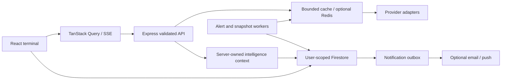

# Architecture

## Preservation decision

Zentra keeps React 19, Vite 8, Express 4, Firebase Auth and named Firestore.
Next.js App Router and PostgreSQL were evaluated during the audit. Replacing
working routing, persistence and Auth would add migration risk without a measured
scale or rendering requirement. Express remains the dedicated typed API layer.
PostgreSQL becomes a candidate when relational reporting or tax-lot accounting
justifies a carefully reconciled migration, rather than a parallel unfinished store.

Node 24 LTS is the deployment baseline. TypeScript 6.0 runs in strict mode:
the installed typescript-eslint peer range does not yet accept TypeScript 7.
React 19.3, Tailwind 4.3 and Vite 8 were upgraded together after compatibility and
dependency audit checks. `package-lock.json` is authoritative for exact versions.

## Responsibilities

| Layer       | Location            | Responsibility                                                                                  |
| ----------- | ------------------- | ----------------------------------------------------------------------------------------------- |
| Domain      | `shared/`           | Brand, normalized data, decimal accounting, indicators, analytics, alert predicates, validation |
| Providers   | `server/providers/` | Runtime-validated external payloads, authentication, timestamps, safe transport                 |
| Services    | `server/services/`  | Caching, quotas, scoped context, snapshots, outbox and background evaluation                    |
| Routes      | `server/routes/`    | Validated boundaries, authentication, rate limits and normalized responses                      |
| Client data | `src/lib/`          | TanStack Query, scoped Firestore subscriptions, authenticated API and SSE lifecycle             |
| UI          | `src/components/`   | Lazy routes, source provenance, reusable charts and terminal surfaces                           |

Shared public market responses contain no user portfolio data. Auth changes clear
the client query cache and collection subscriptions. News relevance uses caller
holdings/watchlists; AI ignores submitted portfolio/price facts and loads its own
structured context. Private AI/social/wallet/data endpoints require Firebase ID tokens.

## Cache and stream behavior

Resource caches bound memory and coalesce concurrent requests. Optional Redis
shares entries, refresh leases, quota reservations and HTTP rate-limit state.
If Redis is configured but unavailable, stale cache or explicit unavailable is
preferred to uncontrolled provider traffic. Failure cooldowns increase exponentially;
there is no aggressive automatic retry loop that consumes a free plan.

SSE accepts up to twelve symbols of one type, limits connections, emits shared
quotes every minute, heartbeats every fifteen seconds and reconnect hints.
Slow consumers are skipped and disconnects clean up timers. A connection expires
after ten minutes and the browser reconnects automatically. This transports
provider marks; it does not transform delayed REST data into exchange realtime.

## Workers and delivery

Workers run with Firebase Admin and can operate without an open browser.
Active alerts and users are scanned in bounded pages; each tick has a soft work
budget and skips overlap in its own process. The alert claim and in-app outbox
write occur in one Firestore transaction. Outbox leases, per-channel completion
flags and retry limits prevent routine duplicate delivery. FCM is at-least-once;
partial provider successes can be repeated on retry.

Large deployments should externalize ingestion/jobs to scheduled workers and
partition account scans. The current cursor is process-local, not a durable
distributed scheduler. See the operational limits in [ROADMAP](ROADMAP.md).

## Build and UI

`vite build` emits the client and generated brand manifest. esbuild bundles the
production server with dependencies external; production uses `dist/` and
`dist-server/`. Market, chart, motion and Firebase chunks are split, and pages
are lazy-loaded behind suspense/error boundaries. Tokens, visible focus states,
reduced motion, keyboard palette handling and horizontal table containers support
responsive and accessible use; formal WCAG certification is not claimed.
